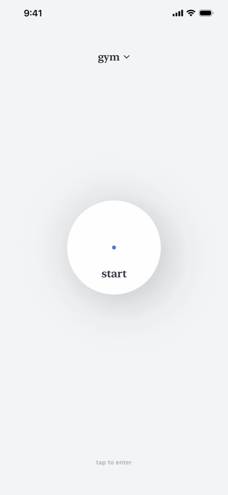
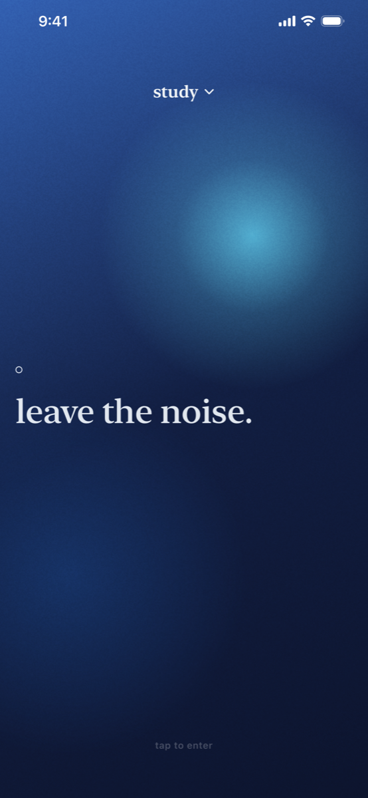
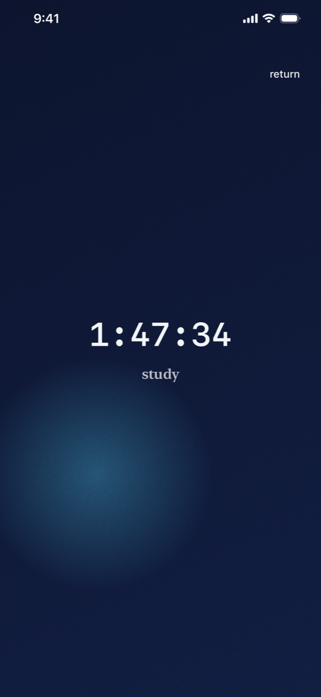
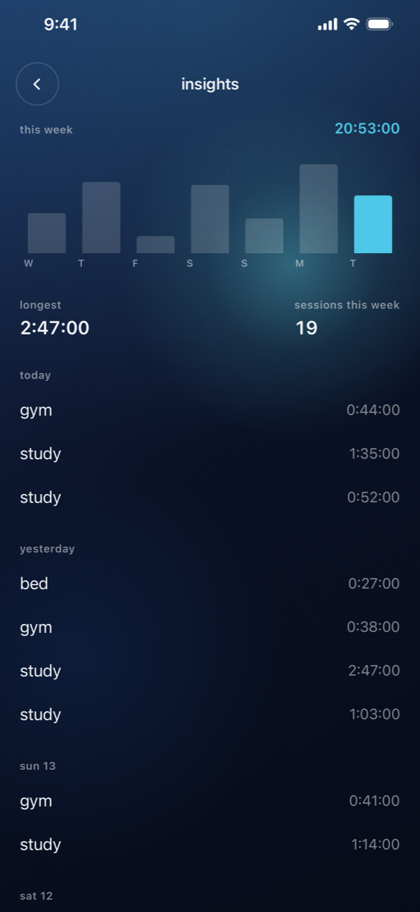

# du vide

An iPhone app blocker where starting a focus session feels like stepping into a different place, not flipping a setting.

<p>
  
  
  
  
</p>

## Why I made it

Most app blockers are settings screens. You toggle something, the app congratulates you, and your phone feels exactly the same. I wanted the moment you lock in to feel like something: you hold to enter, the screen turns into a full-screen "world," and a stopwatch starts. Your distracting apps stay gone until you come back out.

## Built on foqos

The blocking engine comes from [foqos](https://github.com/awaseem/foqos) by Ali Waseem (MIT license). That includes the Screen Time integration, the blocking strategies, the SwiftData models, the DeviceActivity monitor, the shield extensions, Live Activities, and NFC and QR scanning.

What I built on top: the interface, the eight "worlds" (each with its own palette, motion, and clock), the hold-to-enter and exit flow, and the product design around all of it. The design system is in [`docs/design-system.md`](docs/design-system.md). Full attribution is in [`NOTICE`](NOTICE).

## Stack

Swift, SwiftUI, SwiftData, and Apple's Screen Time frameworks (FamilyControls, ManagedSettings, DeviceActivity), plus WidgetKit and ActivityKit for Live Activities. It runs entirely on the device, with no account, no network calls, and no analytics.

## Running it

Needs Xcode 26.

```bash
make build
make test
```

Screen Time doesn't work in the Simulator. The app builds and renders there, but nothing actually gets blocked, so real testing needs a physical iPhone. To run it on your own device, change the bundle identifiers and App Group across the targets and enable the Family Controls capability.

## What's next

- Get Apple's Family Controls distribution entitlement, which it needs before it can go on TestFlight or the App Store.
